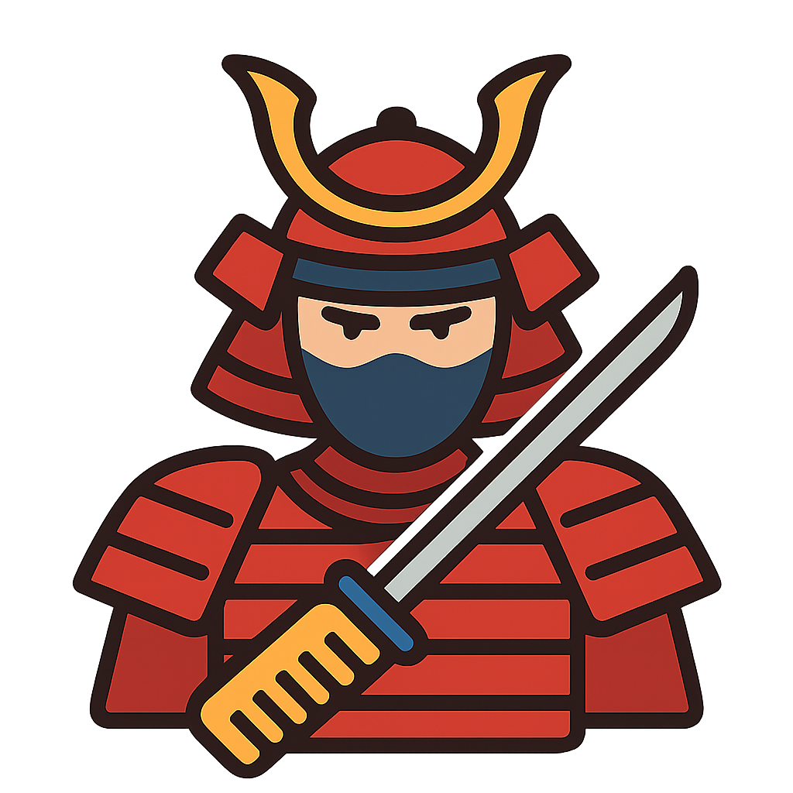

#  Bushidō (武士道)

Indie game developed in `C` using the [`Raylib` graphics library](https://www.raylib.com/).

## 📜 License

This project is licensed under the Apache License 2.0.
See the [LICENSE](./LICENSE).
